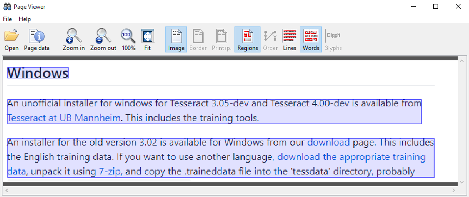

# tesseract 4.0.0 alpha

OCR Engine modes:
* Original Tesseract only.
* Neural nets LSTM only.
* Tesseract + LSTM.
* Default, based on what is available.


## Install at windows

* Downoload zip from [4.0.0-alpha for Windows](https://github.com/tesseract-ocr/tesseract/wiki/4.0-with-LSTM#400-alpha-for-windows)
* unzip to dir `tesseract-4.0.0-alpha`
* Download language data from [here](https://github.com/tesseract-ocr/tesseract/wiki/Data-Files#updated-data-files-for-version-400). (`chi_sim.traineddata` for Simplified Chinese , `eng.traineddata` for English).
* osd.traineddata is necessity
* Mkdir  `tesseract-4.0.0-alpha/tessdata`
* set TESSDATA_PREFIX environment variable to the parent directory of your "tessdata" directory
* Copy `*.traineddata` to `tesseract-4.0.0-alpha/tessdata`


## Run tesseract

### Simple OCR

* English text recognition from test_image2.png

```
\tesseract-4.0.0-alpha>tesseract.exe test_image2.png 1
Tesseract Open Source OCR Engine v4.00.00alpha with Leptonica
```

Then we get the recoginized english test at 1.txt


### Simple OCR for Chinese

* Chinese text recognition from test_image3.png

```
tesseract-4.0.0-alpha>tesseract.exe test_image3.png out -l chi_sim
Tesseract Open Source OCR Engine v4.00.00alpha with Leptonica
```

Then we get the recoginized Chinese test at 1.txt


### Get character location

* run cmd below to get the hocr file

```
\tesseract-4.0.0-alpha>tesseract.exe test_image2.png out hocr
Tesseract Open Source OCR Engine v4.00.00alpha with Leptonica
OSD: Weak margin (1.71) for 78 blob text block, but using orientation anyway: 0
```

* then we get a file out.hocr (each word's location is in this file)
* renam out.hocr to out.xml (hocr is different from page xml format, this convertiong will loss some information, but we can still get text region visualization directly )
* download PAGEViewer from http://www.prima.cse.salford.ac.uk/tools/PAGEViewer
* open out.xml and test_image2.png by PAGEViewer, so we get below pic




