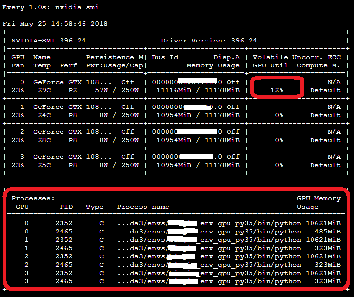

# How to check if keras/tensorflow run on GPU or CPU?

* [check if backend device has GPU](check_backend_devices.ipynb)
* run model training [code](gputest.py), then check gpu status by linux cmd `watch -n 1 nvidia-smi` when model running
* if output as below, your model run on GPU successfully.
   * has GPU usage
   * process run on GPU

* if output as below, your model do not run on GPU.

