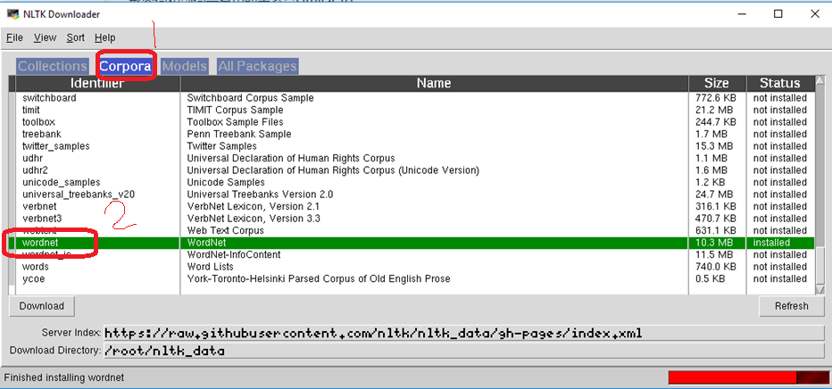

1. what is wordnet

* WordNet.pptx

2. how to install wordnet by nltk

(1) run python code

```
import nltk
nltk.download()
```


(2) Select “corpora”->”wordnet”, press enter to download





3. more examples to use wordnet

https://blog.csdn.net/King_John/article/details/80252594